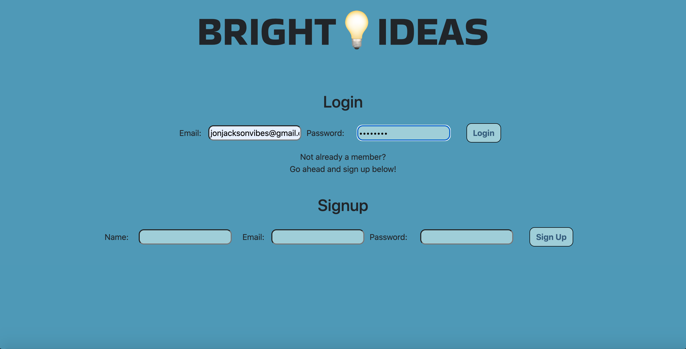
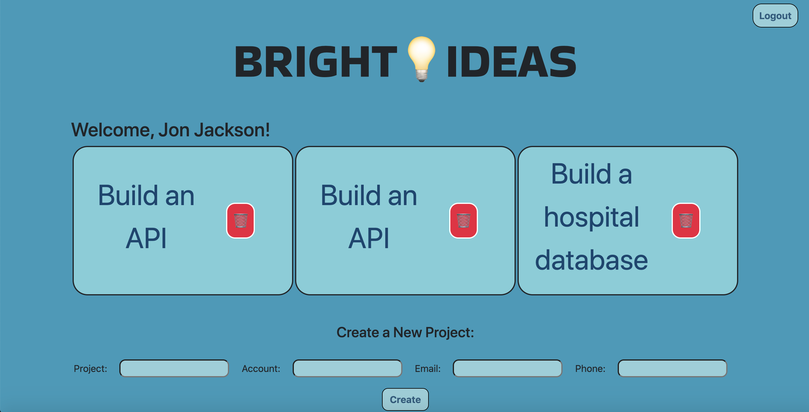
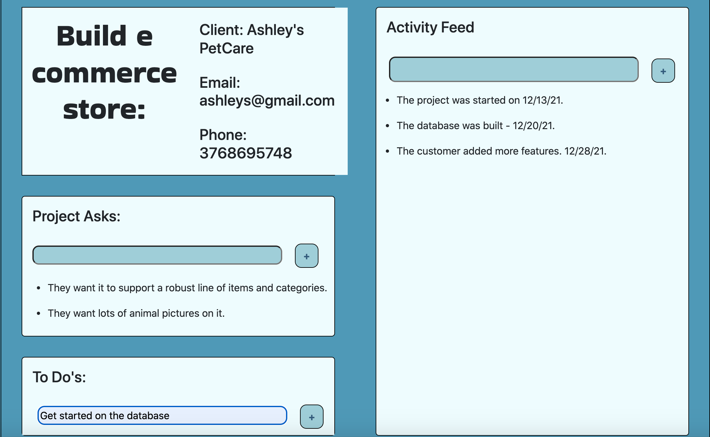

# Bright Ideas

<a name="description"></a>
<!--  Added description -->
## Description
A simple and concise project management system where a user can create and manage their projects from start to finish. They can create a project including relevant information about their client, and within each project they can add items to the 'Project Asks' container, tasks to the 'Tasks' container, and also comments in the 'Activity Feed' container in order to keep track of all relavant activities. The user's profile page will keep all current projects within reach in the form of tiles with each project's respective name. The user can create projects from the form on the profile page as well as delete current projects via the trash can icon on each project tile. 


[](https://opensource.org/licenses/MIT)

## Table of Contents
- [Description](#description)
- [User Story](#userstory)
- [Acceptance Criteria](#acceptancecriteria)
- [Installation](#installation)
- [Usage](#usage)
- [License](#license)
- [Contributing](#contributing)
- [Tests](#tests)
- [Questions](#questions)
- [Video](#video)
- [Screenshots](#screenshots)
- [Links](#links)
- [Resources / Credits](#credits)


<a name="userstory"></a>

## User Story

```md
AS A... project manager
I WANT... an app to track customer projects
SO THAT... my team has increased efficiency and organization
```

<a name="acceptancecriteria"></a>

## Acceptance Criteria

```md
WHEN I click on the link/app
THEN I am taken to the login page
WHEN I input all the asked for information and click on the sign-up button
THEN I am taken to my user profile page
WHEN I fill in project information and click on the button to Create a projec
THEN I see a project is created
WHEN I create a project 
THEN I am taken to the project page for that project
WHEN I am in the project page
THEN I can input all the asked for data 
WHEN I enter inputs in Project Asks, To Do's, and the Activity Feed
THEN I see those inputs are displayed in their respective containers
WHEN I hit the logout button
THEN I am logged out of the application

```

<a name="installation"></a>

## Installation
* Clone the repository using:

```
git clone https://github.com/EMtheDM/BrightIdeas
```
* Be sure that you are in the current working directory
* Create a .env file. (See below in Usage for how to set up.)
* Install the dependencies (bcrypt, connect-session-sequelize, express-handlebars, express, dotenv, mysql2, and sequelize) by opening the terminal and running
```
npm install OR npm i
```
* In the terminal, log into the MySql by typing
```
mysql -u root -p
```
* Then type in your password for MySql. Once logged in, you will need to source the schema file in the db folder. In order to do that, type in the following in the terminal and hit enter afterwards. 
```
SOURCE db/schema.sql;
```
* Once the schema file is sourced, type 'exit' in the command line and get out of mysql.
* The next step is to run the seed data in order to populate the database. To do that, run the following in the command line.
```
npm run seed
```
* Next, run the project by typing the following command in the terminal:
```
npm run start OR node server.js
```

<a name="usage"></a>

## Usage
* In order to use the application, the user can either run the program on their localhost port or access the application via the deployed Heroku link (included below).

* To access via their localhost port, once they have their server running by following the instructions in the previous section, they just need to go to their localhost:3001 (3001 is the port already in place on the server.js file), and the application will run from there. Note - if using the application via localhost, the user will need to create a .env file and create in order to access the application. In the .env file, they will need the following:

```
DB_NAME=brightideas_db
DB_USER=(user-name)
DB_PASSWORD=(user-password)
```

* To access via the deployed link at Heroku, see link below.

* Once the application is running, the user only needs to sign up with their name, email, and chosen password. Once logged in, they'll be on the landing page, otherwise known as their profile page. From here, they can initiate a project by entering in the name of the project, the account or client it is for, the client's email address, and the client's phone number. Once they have, simply hit the 'Create' button, and the tile will appear with the name of that project. 

* The user can go into the Project page by clicking on the name in the tile. Once on the Project page, they will see the information they entered about the client in the top left (or top center if on mobile), and three containers - Project Asks, To Do's, and Activity Feed. Here they can add any information they would like. Project Asks is a container dedicated to requirements made by the client, To Do's is a container dedicated to tasks to implement those requirements, and the Activity Feed is a place to log comments in order to track the project's activity until completion. 

* There is a 'Back to List' button the bottom for the user to go back to their profile page at any time to see their other current projects. They can also use the trash can icons in the project tiles if they wish to delete a project. At the top left, the user may log out at any time.


<a name="license"></a>

## License
Permission is hereby granted, free of charge, to any person obtaining a copy of this software and associated documentation files (the "Software"), to deal in the Software without restriction, including without limitation the rights to use, copy, modify, merge, publish, distribute, sublicense, and/or sell copies of the Software, and to permit persons to whom the Software is furnished to do so, subject to the following conditions:

The above copyright notice and this permission notice shall be included in all copies or substantial portions of the Software.

THE SOFTWARE IS PROVIDED "AS IS", WITHOUT WARRANTY OF ANY KIND, EXPRESS OR IMPLIED, INCLUDING BUT NOT LIMITED TO THE WARRANTIES OF MERCHANTABILITY, FITNESS FOR A PARTICULAR PURPOSE AND NONINFRINGEMENT. IN NO EVENT SHALL THE AUTHORS OR COPYRIGHT HOLDERS BE LIABLE FOR ANY CLAIM, DAMAGES OR OTHER LIABILITY, WHETHER IN AN ACTION OF CONTRACT, TORT OR OTHERWISE, ARISING FROM, OUT OF OR IN CONNECTION WITH THE SOFTWARE OR THE USE OR OTHER DEALINGS IN THE SOFTWARE.


<a name="contributing"></a>

## How to Contribute
1. [Fork the repo!](https://docs.github.com/en/get-started/quickstart/fork-a-repo)
2. Create a feature branch:
```
git checkout -b yourname-branch
```
3. Commit changes:
```
git commit -m 'Your changes here'
```
4. Push to the branch:
```
git push origin yourname-branch
```
5. Submit a pull request and wait for it to be approved or denied.

<a name="tests"></a>

## Tests
No tests available at this time.


<a name="questions"></a>

## Questions
If you have any questions or comments, please feel free to contact our team by email at any of the following:

* Jon Jackson - jonjacksonvibes@gmail.com
* Eric Martin - eric_martin@me.com
* Katlyn Boches - katlynboches@gmail.com


<a name="video"></a>

## Video
https://drive.google.com/file/d/113gfIV0AcIHU4hDy88Nt_sxqwmvaJeOy/view

<a name="screenshots"></a>

## Screenshots


#### Login Page


#### User Profile


#### Project Page


<a name="links"></a>

## Links
Github Repository: https://github.com/EMtheDM/BrightIdeas

Heroku Live Link: Heroku: https://gentle-wildwood-55104.herokuapp.com/


<a name="credits"></a>

## Resources / Credits
This project was authored by Eric Martin, Katlyn Boches, and Jon Jackson. 

Development of the project utilized npm dependencies: bcrypt, connect-session-sequelize, dotenv, express, express-handlebars, express-session, mysql2, nodemon, and sequelize.

We also used the VOV.css library for font animations which offered a fun and polished feel to the application. Links to VOV documentation are as follows:

* VOV.css Deployed Link: https://vaibhav111tandon.github.io/vov.css/
* VOV.css Github Link: https://github.com/vaibhav111tandon/vov.css